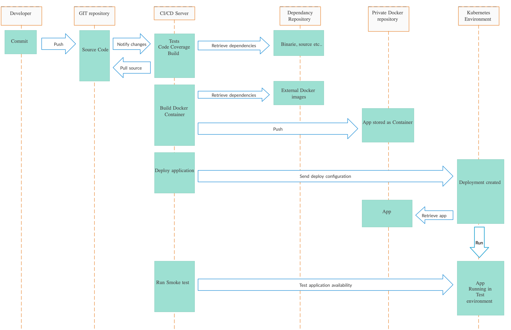

# CI/CD

CI/CD all me mõtleme reeglina “Continuous Integration” ning vastava asutuse strateegiast ja võimalustest lähtuvalt kas “Continuous Delivery” või “Continuous Deployment” protsessidest tarkvara arenduses.

"Continuous Integration" praktika näeb ette, et koodihoidlasse saadetud koodi muutuste peale kompileeritakse ja testitakse, et olla pidevalt kursis koodi kvaliteediga. Eriti oluliseks muutub see siis, kui erinevad arendajad sama projekti kallal töötavad ning oma tulemusi kesksesse koodiharusse saadavad. CI kontrollib kas erinevate arendajate töötulemid omavahel kokku sobituvad.

CI eelduseks on keskne koodihoidla, olgu selleks siis github.com, bitbucket.org vms lahendus avalikus pilves või mõni oma installatsioon (Gitlab, Atlassian tooteperekond) privaatses andmekeskuses. Koodi halduseks on soovitav kasutada mõnda enamlevinud töövoogu nagu näiteks “Feature Branch Workflow”: https://www.atlassian.com/git/tutorials/comparing-workflows/feature-branch-workflow, kus CI rakendatakse reeglina “Master” haru peale.

 "Continuous Delivery" on järgmine samm CI-st, mille eesmärk on väljastada valmis pakendatud tarkvara ning pakkuda sinna vähese vaevaga võimalust see otse mõnda keskkonda paigaldada. Reeglina "Continuous Delivery" puhul erinevad toodangueelsed keskkonnad saavad tarkvara ka automaatselt peale ning manuaalne ehk nupu vajutusega paigaldus jääb toodangu jaoks.

"Continuous Deployment" puhul tehakse sisuliselt samad sammud nagu "Continuous Delivery" puhul, aga on automatiseeritud kogu protsess lõpuni välja, kus ka toodangusse liigub tarkvara automaatselt, nii et käsitsi sekkumist ei ole. Asutustes, kus reliisitakse tarkvara mitu korda päevas, on see ainuke võimalus muudatused kõikidesse keskkondadesse koheselt peale saada.

 CI/CD-d tervikuna nimetatakse ka tehnilises vaates "pipeline"-ks, mis on siis koodi või muul deklaratiivsel kujul (näiteks yaml) defineeritud protsess, mis määratleb kuidas, milliste tehnoloogiatega ja mis kujul rakenduse lähtekood liigub erinevate keskkondade ja töövahendite vahel.
 
"Pipeline" formaat sõltub konkreetsetest töövahenditest, millega seda realiseeritakse ning nende keerukus vastavalt sellele, palju me loogikat sinna kirjutame. 

### Selleks, et edukalt töötav "pipeline" tekitada, on meil vaja oma keskkonda järgmisi komponente:

1. Lähtekoodi hoidla, soovitavalt GIT põhine
2. Lähtekoodi ehitamise, testimise, pakendamise ja paigaldamise  keskkond, mis suudab hakkama saada erinevate programmerimiskeelte ja tehnoloogiatega (näiteks Gitlab, Jenkins, Atlassian Bamboo)
3. Sõltuvuste pakkumise keskkond (üks koht kus saab kätte erinevaid teeke mida näiteks Maven,Pip,Gradle,Go,npm vms tehnoloogiad vajavad)
4. Rakenduse valmispakettide hoiustamise keskkond (näiteks Docker Hub)
5. Keskkond, kuhu tarkvara paigaldada (Docker võimekusega keskkond, näiteks Kubernetes)

### Käesoleva praktikaülesande jaoks oleme valinud järgmised lahendused:

1. Gitlab (GIT)
2. Gitlab (täidab nii CI kui CD rolli)
3. mingi …..
4. Gitlab (Docker repo)
5. Riigipilve Kubernetes klaster

Praktikaülesande sisuks on luua “Hello world” rakendus Go programmeerimiskeele baasil, testida ja ehitada see binaariks ning pakendada Docker konteinerisse ja laadida see privaatsesse Docker repositooriumi.

Teine samm on paigaldada rakendus Kubernetese keskkonda, nii et see oleks konkreetse veebiaadressi pealt kättesaadav. Kubernetesesse paigaldame rakenduse standartsete vahenditega. 

### Eeldused: 

1. Git käsurea utiliit või graafiline vahend nagu Atlassian Sourcetree
2. Sobilik koodieditor pipelinede ja koodi muutmiseks, sobib hästi VS Studio Code
3. Gitlabi konto, mis on emaili teel juba edastatud
4. kubectl käsurea utiliit Kubernetese ligipääsu testimiseks + konto Riigipilves

### "Pipeline" ülesehitus antud praktilise harjutuse vaates on selline:

 [Detailse juhendi leiad siit](task.md)
